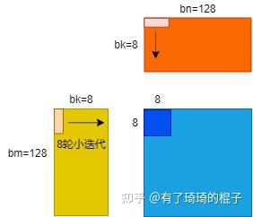
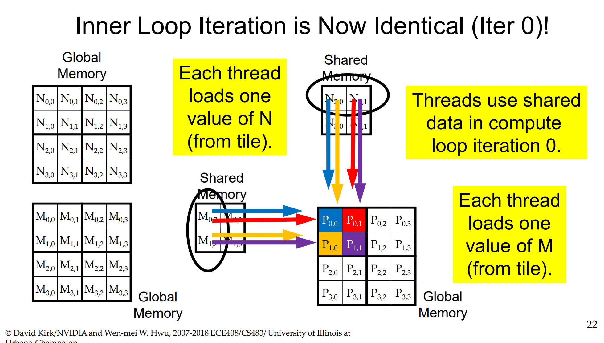
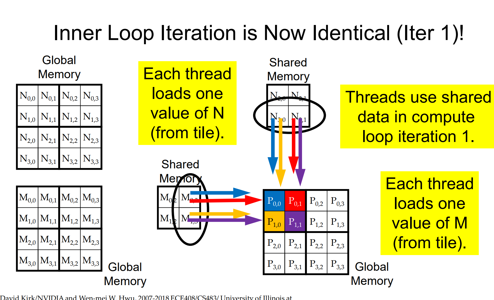
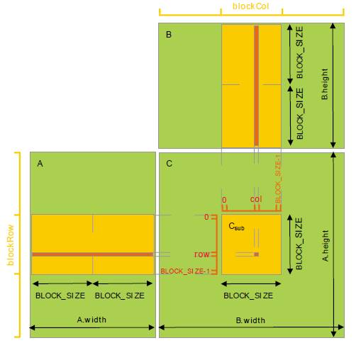
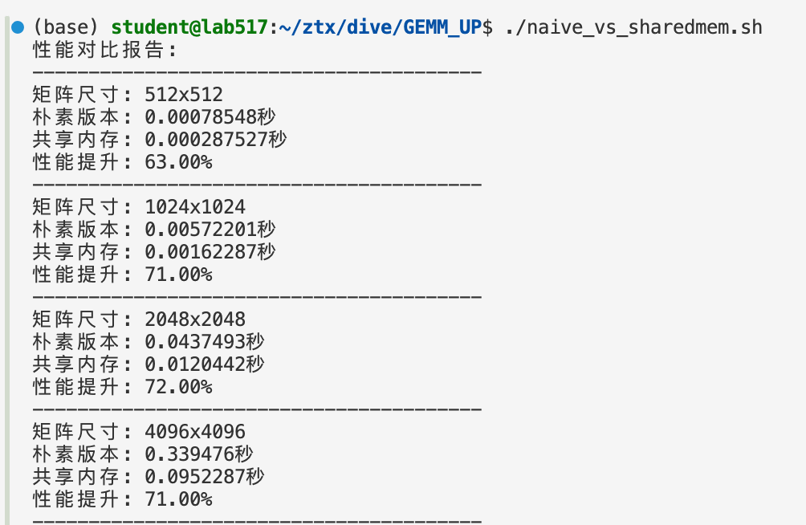
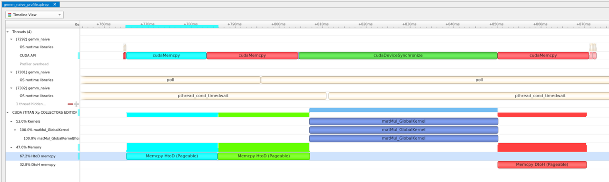
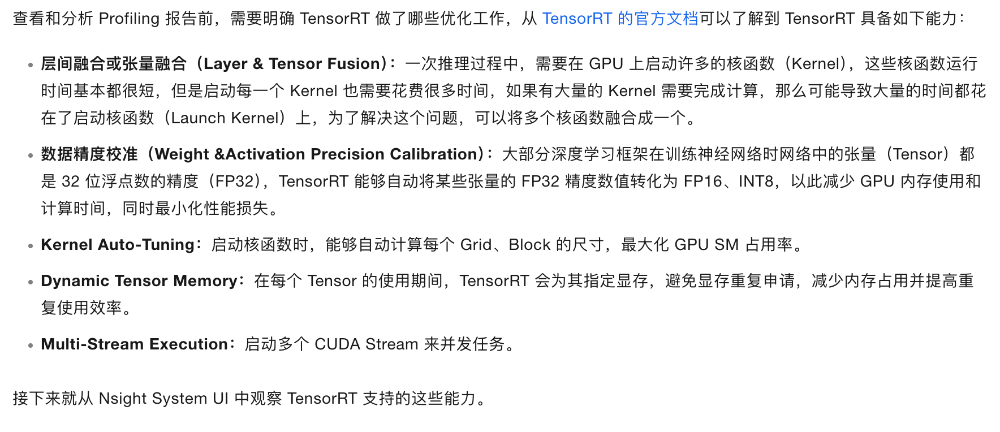

# 02分析
【1】Matrix 2048x2048 - Grid: 64x64 blocks, Block: 32x32 threads

【2】Matrix 2048x2048 - Grid: 16x16 blocks, Block: 32x32 threads

【1】每个block处理${BLOCK\_SIZE}^2$个元素的计算，每个thread处理1个元素，全部从global mem中加载；【2】每个block处理$BM*BN$个元素的计算,每个thread处理$TM*TN$个元素。先加载AB的小tile到shared mem，之后计算对应的小C_tile，结果累加起来。从shared mem中加载需要的数据，减少了对global mem的访存量。

在naive算法中，每一个线程都需要直接从global memory中取数，其时延非常长，计算性能非常差。而进行分块后，将维度为$bm*bk, bk*bn$的tile先存储到shared memory之中。而后计算单元进行计算时可以直接从shared memory中取数，大大减少了访存所需要的时延。

# 03分析

blocksize = bm/rm ，rm指的是寄存器分块的tile大小

## TMTN为什么选择8？
TM（也就是rm，t代表thread，r代表register，在这里指的是同一个东西） 和 TN 的取值也受到两方面限制，一方面是线程数的限制，一个 Block 中有 BM / TM * BN / TN 个线程，这个数字不能超过 1024【我们之前print prop过，1个block中最大就是1024个线程】，且不能太高防止影响 SM 内 Block 间的并行；另一方面是寄存器数目的限制，一个线程至少需要 TM \* TN （8\*8=64）个寄存器用于存放矩阵C的部分和，再加上一些其它的寄存器，所有的寄存器数目不能超过 256，且不能太高防止影响 SM 内同时并行的线程数目。

## 加载进sharedmem后如何计算？——— 何为小迭代？
需要深入的理解这幅图片

我现在理解了这样做如何得到正确结果以及为什么要这样做：

1. 正确结果无非也就是暂存部分计算结果在寄存器里，等待全部加载计算完成后，累加得到正确结果，可以搞一个$（4*2）*（2*4）=（4*4）$理解一下
2. 为什么这么做？区别就在于，同样计算r_c[0][0] r_c[0][1]这俩元素，现在这种方法对于s_a[0][0]的访问是只需要一次的，访问了就放在寄存器里。对于暂时的计算结果也是暂存了放在寄存器里，等待累加！而传统的，先计算r_c[0][0]再计算r_c[0][1]对于s_a[0][0]的访问是需要两次的。这是在Tm=Tn=2的情况下，假如TM=TN=8，就提高了八倍的计算访存比！！
3. 执行完bk次小迭代之后，我们就可以得到蓝色小块中的所有元素的正确答案。




## 线程对应关系？

一个线程处理$8*8=64$个元素计算。我知道这个咋算的。对于一个block，我们总共有$128*128$个元素需要计算，还是在一个block中，tm=tn=8 我们总共有$128/8*128/8=16*16$个线程。所以说一个线程负责$128/16*128/16=8*8=64$个元素（有点唐，见谅……）

但是具体咋对应的呢？也许也可以在我们的缩小版例子中找到答案。

指定了txty之后，我们看上面图片里的蓝色小块

8\*8也就是这个线程负责计算的所有元素！！


# 基于warp和Shared Memory的GEMM优化：
1. 每个 warp 包含 32 个 thread，而 GPU 的指令发射是以 warp 为最小单元的。当 warp 中的一条指令发射一次，称为 1 次 “transaction”，重复发射一次, 称为 1 次 “reply”。当warp中所有线程访问连续内存地址时，GPU会合并为1次内存事务。
2. Naive的做法的问题出在了，当涉及到B矩阵的数据读取时候，由于二维矩阵存储是按行存储的，导致warp访问连续内存空间的功能或者说设计失效了。对于一个width=32*4=128的A矩阵来说，加载所有行数据到内存只需要4个内存事务，但是对于B矩阵来说，由于B矩阵是按列存储的，所以需要128个内存事务才能加载所有列数据。
3. **优化思路**：让一个 block 内的 thread 先从 Global Memory 中读取子矩阵块数据（大小为 BLOCK_SIZE × BLOCK_SIZE）并写入 Shared Memory 中；在计算时，从 Shared Memory 中（重复）读取数据做乘累加，从而避免每次都到 Global 中取数据带来的高延迟影响。接下来让子矩阵块分别在矩阵 A 的行向以及矩阵 B 的列向上滑动，直到计算完所有 width 个元素的乘累加。

就是tiling读取blocksize的子矩阵到sharedmem中，利用sharedmem低延时、高带宽的特性。


```
cd /GEMM_UP
./naive_vs_sharedmem.sh
```

效果：



Nsight System Timeline 分析结果：



- [ ] TensotRT优化对比，据说能：


来自于：https://help.aliyun.com/zh/ack/cloud-native-ai-suite/use-cases/using-nsight-system-to-realize-performance-analysis#cf8415010a2vi

- [ ] 需要NVTX观测batch加载？

# 硬件参数
1. maxThreadsPerBlock = 1024

表示一个线程块中线程总数的上限
这是所有维度线程数的乘积限制

2. Max block dimensions: 1024 x 1024 x 64

表示每个维度上线程数的独立上限
x 维度最多 1024 个线程
y 维度最多 1024 个线程
z 维度最多 64 个线程

可以验证一下，当我们设置block为（64，64）的时候会触发cudacheck：Kernel execution failed: invalid configuration argument

这样超出block restrict 的configuration会被调度器拒绝

3. FLOPs
https://viperatech.com/product/nvidia-hgx-h20/

With 96 GB of HBM3 memory and a 4.0 TB/s memory bandwidth, this GPU delivers unparalleled performance in AI applications. Diverse Tensor Cores, including INT8, FPB, BF16, and FP16, contribute to up to 296 TFLOPS, complemented by an additional 74 TFLOPS from the TF32 Tensor Core. 

我们这款H20是140GBHBM的，算力296TFLOPs，TF32core还能额外带来74TFLOPs


# 参考资料

https://lumetta.web.engr.illinois.edu/408-Sum24/slide-copies/ece408-lecture5-CUDA-tiled-matrix-multiplication-Sum24.pdf