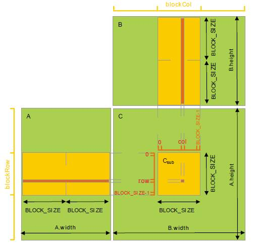
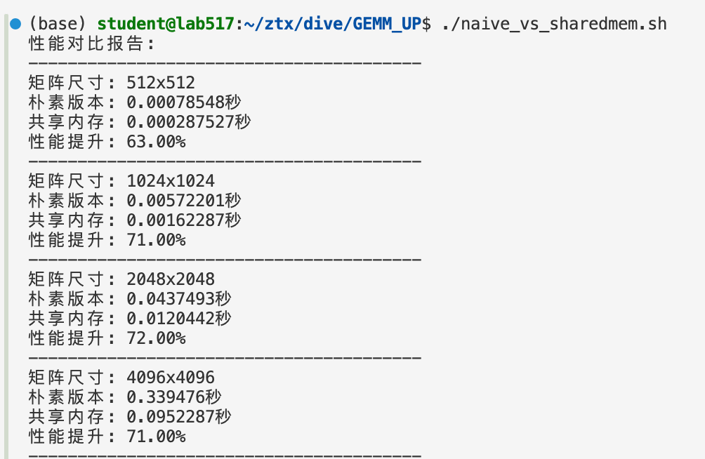

基于warp和Shared Memory的GEMM优化：
1. 每个 warp 包含 32 个 thread，而 GPU 的指令发射是以 warp 为最小单元的。当 warp 中的一条指令发射一次，称为 1 次 “transaction”，重复发射一次, 称为 1 次 “reply”。当warp中所有线程访问连续内存地址时，GPU会合并为1次内存事务。
2. Naive的做法的问题出在了，当涉及到B矩阵的数据读取时候，由于二维矩阵存储是按行存储的，导致warp访问连续内存空间的功能或者说设计失效了。对于一个width=32*4=128的A矩阵来说，加载所有行数据到内存只需要4个内存事务，但是对于B矩阵来说，由于B矩阵是按列存储的，所以需要128个内存事务才能加载所有列数据。
3. **优化思路**：让一个 block 内的 thread 先从 Global Memory 中读取子矩阵块数据（大小为 BLOCK_SIZE × BLOCK_SIZE）并写入 Shared Memory 中；在计算时，从 Shared Memory 中（重复）读取数据做乘累加，从而避免每次都到 Global 中取数据带来的高延迟影响。接下来让子矩阵块分别在矩阵 A 的行向以及矩阵 B 的列向上滑动，直到计算完所有 width 个元素的乘累加。

就是tiling读取blocksize的子矩阵到sharedmem中，利用sharedmem低延时、高带宽的特性。


```
cd /GEMM_UP
./naive_vs_sharedmem.sh
```

效果：



Nsight System Timeline 分析结果：


- [ ] TensotRT优化对比，据说能：


来自于：https://help.aliyun.com/zh/ack/cloud-native-ai-suite/use-cases/using-nsight-system-to-realize-performance-analysis#cf8415010a2vi

- [ ] 需要NVTX观测batch加载？

