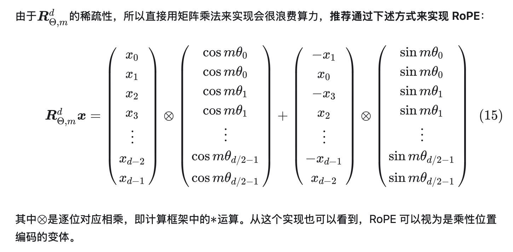

动手学LLM
# Todo List
Todo顺序：Llama Transformer -> FlashAttention -> llama.cpp -> 量化 

- [ ] llama系列
  - [ ] Transformer
    - [x] MHA
    - [x] RoPE  （有一个版本的理解，但是不会写，还是不够懂）
    
    - [ ] KVcache
    - [ ] RMSNorm
  - [ ] llama.cpp
  - [ ] llama2
    - [ ] GQA
  - [ ] llama3.1
    - [ ] 暂时不了解有哪些改进

- [ ] FlashAttention
  - [ ] python
  - [ ] cpp
  - [ ] cuda

- [ ] 量化

# 文件说明

1. RoPE1.py：最简单的版本（基于llama）+维度变换注释
2. RoPE_llama.py：llama源码
3. RoPE_extra.py：研究外推性【训练max_seq_len=512，推理时候实际序列长度大于该值，模型精度？相关性？不变？不太懂】

# 碎碎念

Pytorch，Pytorch，你的代码还是太复杂了，有没有更加简单易懂一点的代码推荐一下？☝️😃
需要git config自己的账号啊，我说咋一直不是我在提交，诡异
